<script type="text/x-mathjax-config">MathJax.Hub.Config({tex2jax:{inlineMath:[['\$','\$'],['\\(','\\)']],processEscapes:true},CommonHTML: {matchFontHeight:false}});</script>  
<script type="text/javascript" async src="https://cdnjs.cloudflare.com/ajax/libs/mathjax/2.7.6/MathJax.js?config=TeX-AMS_CHTML"></script>  
<script type="text/javascript" async src="https://cdn.jsdelivr.net/npm/mathjax@3/es5/tex-chtml.js" id="MathJax-script"></script>  

スプライン補間器
===

# 1. 動作表現モデルとしてのスプライン補間 

点の動作を計算機で表現し、操作したい。  

話を簡単にして、ここでは１次元の点の動作を考える。  
点の位置を表す変数を $x$ とする。  


静止した点とは異なり、動作する点の位置は時間と共に発展する。  
以下の漫画のように、位置の動作を座標軸１本だけで１枚の図中に表すのは難しい。  


もう１本、時間 $t$ の座標軸を使って表現しよう。  
すると位置 $x$ は時間 $t$ の関数 $x(t)$ として平面上に表現できる。  

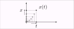

位置の時間関数 $x(t)$ は、以下のように時間 $t$ の1次式、2次式、... n次式でモデル化して表現することができるだろう。  
また、sin関数やcos関数、指数関数 $e^{f(t)}$ や対数log関数でモデル表現することもできるだろう。  
動作のモデル表現によって関数の式の取り方は様々である。

$$
\begin{array}{l}  
x(t) = -9.87 (t-1.5)(t-0.6) + 3.2 \\\\  
x(t) = 7.9 \cdot \mathrm{sin} (t - 4 \pi ) \\\\  
x(t) = e^{-3.1 \cdot t^2} + 5t - 4 \\\\  
x(t) = 9t \ \mathrm{log} (t) \\\\  
\cdots \ etc. \\  
\end{array}
$$

上記例ではどれも、一つの決まった式、係数や関数の中身が固定された式で表現されている。  
一つの決まった式よりも、以下のように様々な係数の高次多項式を時間と共に区分的に切り替えて変容できた方が多彩な表現を期待できる。 

$$
\begin{array}{rl}  
 x(t | 0.0 \le t < 1.0) =& -0.0205976\ t^3 + 0.0205976\ t^2 - 1.0  \\\\   
 x(t | 1.0 \le t < 2.0) =&  0.150747\ (t-1.0)^3  - 0.0411951\ (t-1.0)^2  - 0.0205976\ (t-1.0) - 1 \\\\  
 x(t | 2.0 \le t < \cdots) =& \cdots  
\end{array}
$$

このような区分多項式を用いて離散的な複数点間同士を任意の補間曲線で結ぶ、スプライン曲線(※)は動作のモデル表現として有用である。  

(※) スプライン曲線については、「[付録. メモ：スプライン曲線とは](#付録-メモスプライン曲線とは)」参照。

&nbsp;

## 1章のまとめ

- 動作表現モデルとして、位置を時間の区分多項式で表す方法を採用する。


&nbsp;

<div style="page-break-before:always"></div>

# 2. 境界条件と曲線の決定

高次多項式の曲線どうしを滑らかに接続したい。  
言い換えると、接続される点で連続かつ微分可能となるように接続したい。  
境界点で連続かつ微分可能となるように k 次の多項式の曲線を決定するには、接続点(境界点)の k-1 次の値を知る必要がある。 
このことを図に表してみよう。  

まず位置-時間平面の曲線 $x(t)$ を考えてみる。   
ある時刻 $t_i$ で曲線から曲線へ遷移(スイッチ)するとき、その境界点の位置の値 $x_i$ が与えられたとする。  


境界点時刻 $t_i$ より前(過去)の時刻における位置-時間曲線を $x_{i}(t)$ とし、後(未来)の曲線を $x_{i+1}(t)$ とする。   
この時間曲線 $x_{i}(t)$ を次の曲線 $x_{i+1}(t)$ へ境界点 $( t_i, x_i )$ で連続かつ微分可能となるように接続したい。  
しかし境界点時刻 $t_i$ において位置 $x_i$ の値を知るだけでは、境界点で連続かつ微分可能となるよう接続できるように２次以上の k 次多項式の位置-時間曲線 $x_{i}(t)$ と $x_{i+1}(t)$ の形状を決定するには情報が不足している。  
連続かつ微分可能となるには、 その境界点での曲線の傾きを知る必要がある。  

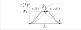

時間関数の境界点の傾きとは、その点での時間による位置の1階微分を意味する。    
位置の時間微分とは速度である。位置の時間関数 $x(t)$ における傾きは、速度 $\dot{x}(t)$ に対応する。  
つまり、境界点 $( t_i, x_i )$ において位置-時間曲線 $x_{i}(t)$ と $x_{i+1}(t)$ を連続かつ微分可能となるように接続するには、さらに接続点での速度値 $\dot{x}_{i}(t)$ が必要といえる。  

<div style="page-break-before:always"></div>

物体の運動は、位置の時間変化と同時に速度、加速度 、、の時間変化を含む。  
境界点のような瞬時の点においても、位置の値と同時に速度、加速度の値が含まれる。    

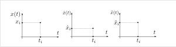

位置の点の傾きは、その時刻での位置を時間微分した値、速度値に対応する。  
速度の点の傾きは、その時刻での速度を時間微分した値、加速度値に対応する。   
境界点で位置だけでなく速度においても連続かつ微分可能となるには、その境界点時刻での速度の傾きつまり加速度値が必要といえる。これは言い換えると、位置が2階微分できる時間関数であることが必要といえる。  


境界の情報が決まれば、位置の曲線は時間多項式モデルの形状に従って決まる。  

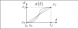

<div style="page-break-before:always"></div>

以上より、  
境界点で連続かつ微分可能となるよう接続できる時間多項式曲線とは、以下の情報が揃っていることで決まるといえる。

- 位置の時間(高次)多項式モデル
- 境界点の時刻、 n 階微分値

どのような多項式モデルを選択するかはユーザの選択に委ねられる。  
一方、境界点の n 階微分値とは、何階までの値が必要か？多項式の次数と同じ数なのか？それより少ないのか？補間器に自動計算させる要求範囲と結びつく。  
ユーザとしては、境界点の入力は時刻と曲線の 0 階微分値のみ、つまり位置の値の入力のみで済むのが簡単だろう。  
ユーザが境界点での曲線の 1 階微分値や 2 階微分値つまり速度値や加速度値まで指定したいというケースは、よほど専門的なシーンに限られるだろう。  
ただし、速度値や加速度値まではわざわざ入力したくないが、境界点での速度が連続かつ微分可能であって欲しいという要求はあるだろう。この場合、位置は2階微分可能な2次以上の時間多項式である必要があり、かつ時刻と位置の入力から何かしらの補間計算モデルにより境界点の速度を自動算出できる必要がある。  

&nbsp;

## 2章のまとめ

- ユーザは曲線形状を決めるスプライン補間器の(多項式)モデルを選択する。  
- ユーザは境界条件として境界点の時刻と位置、速度、加速度、、を入力する。  
  - ユーザが境界点の速度、加速度、、を入力しない(時刻と位置のみを入力する)場合、  
    かつ境界点で速度が連続かつ微分可能であって欲しい場合、  
    - 位置の時間関数は2次以上の時間多項式とする。  
    - 時刻と位置の入力から何かしらの補間計算モデルにより自動で境界点速度を算出する。  

&nbsp;

<div style="page-break-before:always"></div>


# 3. ユーザ入力パターン

## スプライン補間器のモデル選択

ユーザは曲線形状を決める補間器モデルを選択する。

実装例) 3次元スプライン補間器を選択。　　

```cpp  
#include "cubic_spline_interpolator.hpp"
〜〜
  SplineInterpolator* sp;
  sp = new CubicSplineInterpolator();
```

続いて、ユーザは曲線が通過する制御点(境界点)、境界条件の入力をする。  
境界条件の入力パターンは各補間器モデルで共通化することができる。  
以降、入力パターンを挙げる。

&nbsp;

<div style="page-break-before:always"></div>

## パターン1―開始と終了の２点

ユーザは曲線の両端(境界)の２点を指定する。

- 境界点の時刻
  - 開始時刻 $t_{0}$  
  - 終端時刻 $t_{f}$  
- 境界点の位置  
  - 開始位置 $x_{0}$  
  - 終端位置 $x_{f}$  
- 境界点の速度  
  - 開始速度 $\dot{x}_{0}$  
  - 終端速度 $\dot{x}_{f}$  
- 境界点の加速度  
  - 開始加速度 $\ddot{x}_{0}$  
  - 終端加速度 $\ddot{x}_{f}$  

以上の入力より、補間器は自動で多項式のパラメータを計算し曲線を内挿して決定する。  
計算方法は各モデルによって異なる。  


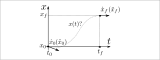

**実装例)**   
以下は3次多項式による補間の例である。　　

```cpp  
#include "cubic_spline_interpolator.hpp"
〜〜
  SplineInterpolator* sp;
  sp = new CubicSplineInterpolator();
  double start_time = 0.0;
  double start_position = 1.0;
  double start_velocity = -1.0;
  double start_acceleration =  0.4;
  double finish_time = 1.5;
  double finish_position = 3.0;
  double finish_velocity = 0.0;
  double finish_acceleration = 0.0;
  RetCode ret = sp->generate_path( start_time,         finish_time,
                                   start_position,     finish_position,
                                   start_velocity,     finish_velocity,
                                   start_acceleration, finish_acceleration );
```

上記開始-終端の2点(＊印)を補間した、3次多項式の曲線の位置および速度の軌道を以下に示す。

位置  
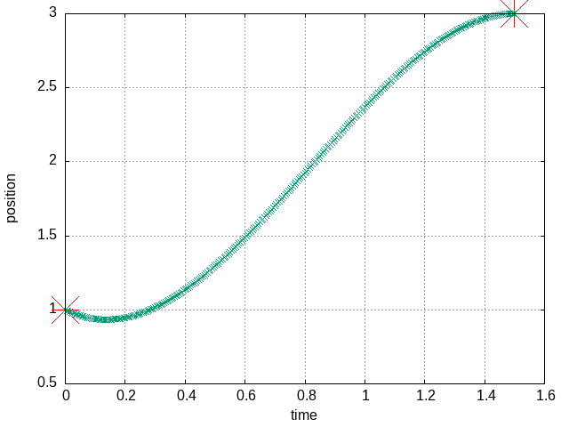  
<!--    -->

速度  
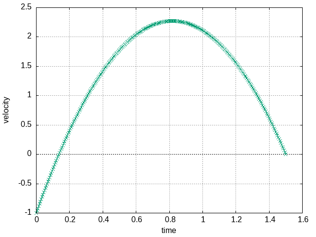  
<!--    -->

&nbsp;

<div style="page-break-before:always"></div>

## パターン2―複数の制御点

ユーザは曲線が通過する開始-終了両端の２点、および通過する中間点群を入力する。  

このとき、開始-終了両端２点は速度、加速度までの境界条件を指定するが、中間点は時刻-位置のみで良い、とする。  

- 各点の時刻・位置の時系列キュー $[(t_{0}, x_{0}), ..., (t_{f}, x_{f}) ]$  
- 開始-終了の両端の速度
  - 開始速度 $\dot{x}_{0}$
  - 終端速度 $\dot{x}_{f}$
- 開始-終了の両端の加速度  
  - 開始加速度 $\ddot{x}_{0}$  
  - 終端加速度 $\ddot{x}_{f}$  

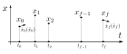  

補間器は、中間点の速度、加速度をどうやって自動算出するか？が課題となる。  
何かしらのモデル固有の拘束条件を用いて自動的に算出する必要がある。  

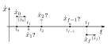

ただし、自動補間された速度を通る曲線は、制御点付近で位置の行き過ぎ量(オーバーシュート)が大きくなる場合もあり、ユーザにとって好ましくない結果となるかもしれない。  
ユーザが各点の通過速度を１つずつ指定したい場合は、パターン１を利用する。  

&nbsp;

**実装例1)**  
時刻-位置の列を3次スプラインで補間する。 

3次スプラインは、メジャーな補間方法の一つである。  
時間と位置の経由点列が与えられ、中間の経由点間の速度・加速度が不明でも、境界連続を条件にして、各区間の3次曲線のパラメータを線形連立方程式によりまとめて解く。  


```cpp
#include "cubic_spline_interpolator.hpp"
〜〜
  TPQueue tp_queue; // TP = time, position
  tp_queue.push_on_dT( 0.0, -1.0 );
  tp_queue.push_on_dT( 1.0, -1.0 );
  tp_queue.push_on_dT( 2.0, 0.0 );
  tp_queue.push_on_dT( 3.0, 10.1 );

  const double start_velocity = 0.0;
  const double finish_velocity = 0.0;
  const double start_acceleration = 0.0;
  const double finish_acceleration = 0.0;

  SplineInterpolator* sp;
  sp = new CubicSplineInterpolator();
  sp->generate_path( target_tp, 
                     start_velocity,     finish_velocity,
                     start_acceleration, finish_acceleration );
```

上記 `tp_queue` の経由点(＊印)を補間した、3次スプライン曲線の位置および速度の軌道を以下に示す。

位置  
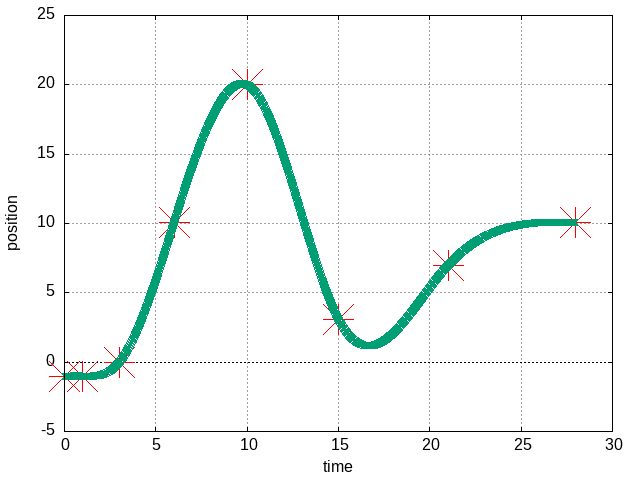  
<!--    -->


速度  
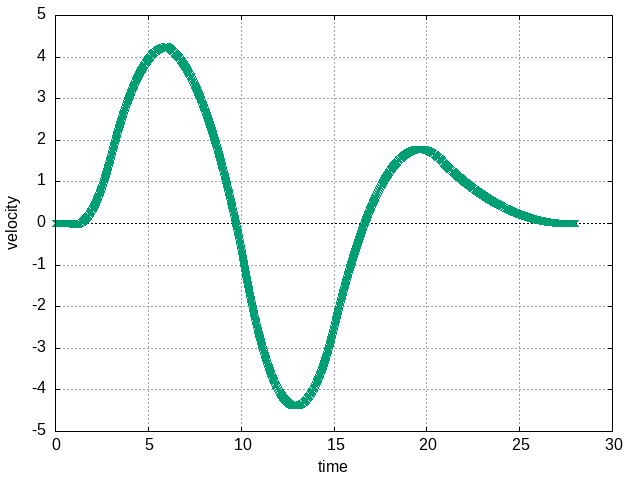  
<!--    -->


3次スプラインは lagrange補間やその他の高次多項式補間に比べると、比較的 低次であり計算量が軽量、かつ曲線の変動(変曲点の数)も少ない。  
ただし先にも述べたように、自動補間された経由点の速度により、場合によっては制御点付近で位置の行き過ぎ量(オーバーシュート)が発生することがある。このベタな対策として、前後の時間で位置を重複させて速度が大きくならないようにするという手がある。ただし曲線は振動的になるかもしれない。調整が難しければ、明示的に境界速度を指定するパターン１を利用するのも選択の一つである。 

&nbsp;

<div style="page-break-before:always"></div>

**実装例2)**  
丸み不均一スプラインを用いて境界速度を計算し、2点境界値に基づいて3次多項式で補間する。

中間点の速度が不明で、かつモデル固有の拘束条件が不明なとき、たとえば時刻-位置の３点が分かれば、丸み不均一スプラインを用いて中間の速度を自動補間する方法もある。  
つまりこれは、各時間区間の開始-終端の2点境界値を先に求め、次にその2点区間を多項式で補間するという２段階のプロセスになる。  

```cpp
#include "non_uniform_rounding_spline.hpp"
#include "cubic_spline_interpolator.hpp"

〜〜

  SplineInterpolator* sp;
  sp = new CubicSplineInterpolator();
  NonUniformRoundingSpline nurs;
  TimePVA start, finish;
  const double dT = 1.0;
  nurs.push_on_clocktime( 0.0, -1.0 ); // P0 start position
  nurs.push_on_dT( dT, -1.0 ); // P1
  nurs.push_on_dT( dT, 10.0 ); // P2 finish position
  start  = nurs.pop();         // out P0
  nurs.push_on_dT( dT, 10.0 ); // Dummy1
  finish = nurs.pop();         // out P1
  sp->generate_path( start.time,           finish.time,
                     start.P.position,     finish.P.position,
                     start.P.velocity,     finish.P.velocity,
                     start.P.acceleration, finish.P.acceleration );
〜〜
  // pop / plot 
〜〜

  start = finish;  
  nurs.push_on_dT( dT, 10.0 ); // Dummy2
  finish = nurs.pop();         // out P2
  sp->generate_path( start.time,          finish.time,
                     start.P.position,    finish.P.position,
                     start.P.velocity,    finish.P.velocity,
                     start.P.acceleration finish.P.acceleration );
〜〜
  // pop / plot 
〜〜
```

位置  
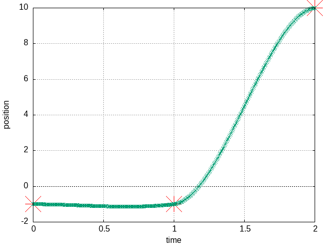  
<!--    -->

速度  
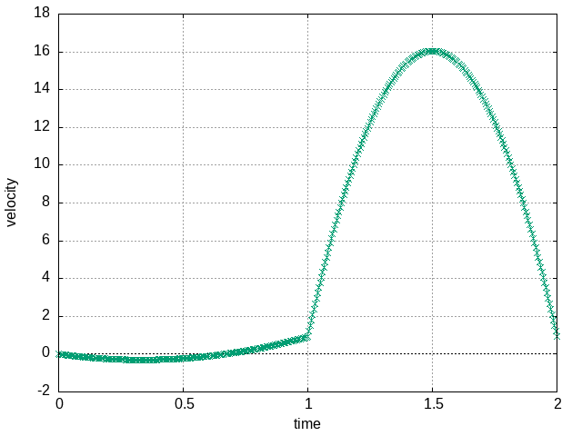  
<!--    -->


&nbsp;

<div style="page-break-before:always"></div>


## パターン３―速度と加速度の制約

ユーザは、最大速度、最大加速度・減速度を設定する。  

最も分かりやすい例は、台形速度軌道である。  
台形速度軌道は、設定された最大速度、最大加速度・減速度により、加速、等速、減速の順に軌道を構成する。  
位置と速度の軌道は、それぞれ以下の図のような軌道になる。  

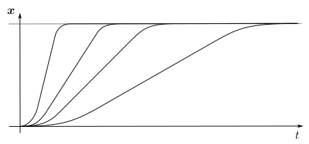
最大速度、最大加速度・減速度の設定による、位置の時間軌道パターン変化

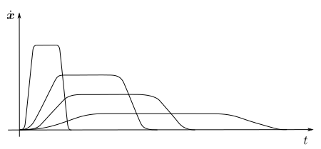
最大速度、最大加速度・減速度の設定による、速度の時間軌道パターン変化

速度、加速度・減速度の制約の中で、最速で移動できる最短移動時間が自動で決まる。この最速軌道を 100％ もしくは比率 1.0 とする。  
ユーザは、移動時間の代わりに、速度％もしくは速度比率によって速さ(スピード)を指定することができる。  
制約を満たしつつ、入力として指定した経由点の位置、経由点間の速度比率、開始と終端の位置・速度に従って連続な時間軌道が自動生成される。  

- 経由点間の速度と加速度・減速度のリミットのキュー  
  $[ (v_{\mathrm{limit},0}, a_{\mathrm{max},0}, d_{\mathrm{max},0}), ..., (v_{\mathrm{limit},f-1}, a_{\mathrm{max},f-1}, d_{\mathrm{max},f-1}) ]$  
  - 最大速度リミット $v_{\mathrm{limit},k}$
  - 最大加速度・減速度 $a_{\mathrm{max},k}$ , $d_{\mathrm{max},k}$
- 経由点列 : 速さと位置のペアで組み合わせた時系列キュー  
  $[ (s_{p,0}, x_{0}), ..., (s_{p,f}, x_{f}) ]$  
  - 各経由点間の速さ(スピード) $s_{p,k}$  
    - 速度％ : $s_{p,k} := R_k\in(0.0,100.0]$  
      もしくは対応する速度比率 : $s_{p,k} := r_k (= R_k/100.0) \in(0.0, 1.0]$  
      もしくは対応する経由点上の通過時刻 : $s_{p,k} := t_k ( = r_k T_{\min}) \in (0.0, T_{\min}]$  
  - 各経由点の位置 $x_k$    
- 開始-終了の両端の速度
  - 開始速度 $\dot{x}_{0}$
  - 終端速度 $\dot{x}_{f}$

このパターンでは、設定された最大速度リミットと最大加速度・減速度から、以下の図のように（？）で示すような経由点の通過時刻、境界速度/加速度といった不明なパラメータを自動算出する機能が求められる。

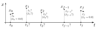  

通常、３次スプライン補間では、速度や加速度の制約を指定できないため、このような機能を実現できない。  

そこでたとえば、ラッキグ(Ruckig)ライブラリのように、速度リミット、加速度・減速度リミットに加え、躍度（Jerk）のリミットを指定し、 3-2-3-1-3-2-3次の区分的なスプライン補間を用いることで、設定の機能を実現することができる（ただし一部の機能は有償らしい）。  
Ruckig (Git-Hub) : [https://github.com/pantor/ruckig](https://github.com/pantor/ruckig)  

本ライブラリでは 5-2-5-1-5-2-5次の区分的なスプライン補間を提供する。  

詳細説明 T.B.D.  

位置  
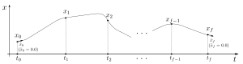  

速度  
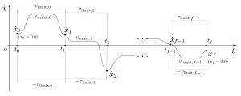  

加速度  
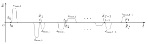  


&nbsp;

<div style="page-break-before:always"></div>

# 4. 利用シーンの追究

## シーン1―入力した(複数の)補間点間を全て一度に補間し曲線生成


### ユーザのアクション

1. ユーザは複数補間点の時刻・位置の時系列キュー $[(t_{0}, x_{0}), ..., (t_{f}, x_{f}) ]$ を補間器へ入力する。  
2. ユーザは(たとえば動作再生器(sequence player)のような媒体を介して)動作再生を実行する。

### 補間器のアクション

1. 補間器はユーザ入力された補間点キューの中間点群の速度・加速度をすべて自動算出する。  
2. 補間器は境界点の速度・加速度が算出された補間点間の曲線をすべて生成する。  
3. 補間器は生成された曲線(パラメータ)をすべてリアルタイム動作再生のキューにエンキューする。  
4. 再生側では動作再生器(sequence player)のような媒体がおり、この再生器はリアルタイムクロックでカウントされるタイマーを用いて周期的にループし補間器へ出力指令を送り続ける。  
   補間器はリアルタイム時刻 $t_k$ が時間区分に収まる曲線(パラメータ)をデキューし、位置 $x_k$, 速度 $\dot{x}_k$, 加速度 $\ddot{x}_k$ を計算し再生先へ出力する。  

<div style="page-break-before:always"></div>

## シーン2―補間点の追加と曲線生成のタイミングを制御

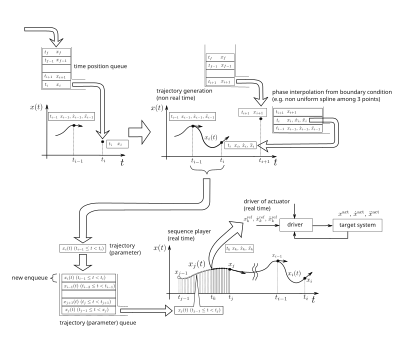

### ユーザのアクション

1. ユーザは時刻・位置 $(t_f, x_f)$ の補間点を任意のタイミングで補間器へ入力する。  
  (補間点キューが一定以上(たとえば3点以上)貯まると同時に曲線生成が実行される)  
2. ユーザは(たとえば動作再生器(sequence player)のような媒体を介して)動作再生を実行する。
3. 補間器がリアルタイムに曲線動作再生中、ユーザは非同期に補間点をキューへ追加入力する。

### 補間器のアクション

1. 補間器は時刻・位置 $(t_f, x_f)$ の補間点キューが一定以上貯まったら、中間点の速度・加速度を自動算出する。  
2. 補間器は境界点の速度・加速度が算出されたものから順次補間点間の曲線を生成する。
3. 補間器は生成された曲線(パラメータ)をリアルタイム動作再生のキューにエンキューする。  
4. 再生側では動作再生器(sequence player)のような媒体がおり、この再生器はリアルタイムクロックでカウントされるタイマーを用いて周期的にループし補間器へ出力指令を送り続ける。  
   補間器はリアルタイム時刻 $t_k$ が時間区分に収まる曲線(パラメータ)をデキューし、位置 $x_k$, 速度 $\dot{x}_k$, 加速度 $\ddot{x}_k$ を計算し再生先へ出力する。  

<div style="page-break-before:always"></div>

## シーン3―割り込み入力による曲線のリアルタイム更新

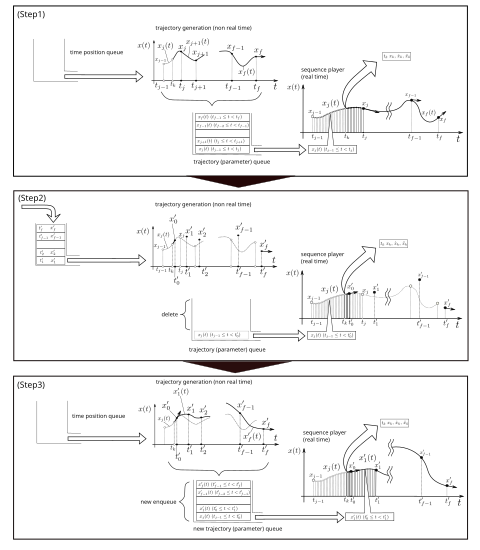

### ユーザのアクション

1. (Step1)まではシーン１と同様。ユーザは、時刻・位置のキューを入力し、動作再生を実行する。
2. 動作再生実行中、ユーザは入力済みの時刻・位置のキューをクリアし、新しいキューを割り込んで入力する(Step2)。  
   動作は位置・速度ともに連続して滑らかに遷移しながら再生を続けられる(〜Step3)。  

### 補間器のアクション

1. (Step1)まではシーン１と同様。補間器は曲線動作再生を実行中である。
2. (Step2)で補間器はユーザから割り込み動作入力を受け取る。  
3. 補間器は再生中の曲線動作の現在時刻 $t_k$ の点から補間計算時間を加味した遷移開始時刻 $t'_0$ を特定する。  
4. 補間器はリアルタイム動作再生のキューを再生中の曲線のみ残し、再生中の曲線の終端時刻を $t'_0$ に置換する。  
5. 補間器は遷移前の軌道から遷移開始時刻 $t_0$ における位置 $x'_0$ ・速度 $\dot{x}'_0$ ...を抽出する。  
6. 補間器は遷移開始時刻・位置・速度および新しい時刻・位置のキューから、中間点群の速度・加速度をすべて自動補間する。  
   以降、補間器はシーン１の補間器のアクションと同様に処理実行する(〜Step3)。  

&nbsp;


<div style="page-break-before:always"></div>

## 付録. メモ：スプライン曲線とは

スプライン曲線は I.J.シェーベルグの _Isaac Jacob Schoenberg, "Contributions to the problem of approximation of equidistant data by analytic functions", 1946_ で最初に数学的に定義されたという。本論文では以下のように定義されていたそうだ。  

> ### 3.1. Polynomial spline curves of order $k$
> 
> A spline is a simple mechanical device for drawing smooth curves. It is a slender flexible bar made of wood or some other elastic material. The spline is placed on the sheet of graph paper and held in place at various points by means of certain heavy objects (called "dogs" or "rats") such as to take the shape of the curve we wish to draw. Let us assume that the spline is so placed and supported as to take the shape of a curve which is nearly parallel to the $x$-axis. If we denote by $y = y(x)$ the equation of this curve, then we may neglect its small slope $y'$, whereby its curvature becomes
> 
> $$
> \frac{1}{R} = \frac{y''}{\left( 1 + y'^2 \right)^{3/2}} \approx y''.
> $$
> 
> The elementary theory of the beam will then show that the curve $y = y(x)$ is a polygonal line composed of cubic arcs which join continuously, with a continuous first and second derivative. These junction points are precisely the points where the heavy supporting objects are placed.
> 
> #### 3.11. Description of spline curves of order $k$
> 
> Our last remark suggests the following definition.
> 
> **Definition 4.**  
> A real function $F(x)$ defined for all real $x$ is called a spline curve of order $k$ and denoted by $\Pi_k(x)$ if it enjoys the following properties:
> 
> 1. It is compressed of polynomial arcs of degree at most $k - 1$.  
> 2. It is of class $C^{k - 2}$, i.e., $F(x)$ has $k - 2$ continuous derivatives.  
> 3. The only possible function points of the various polynomial arcs are the integer points $x = n$ if $k$ is even, or else the points $x = n + 1/2$ if $k$ is odd.
> 
> Thus a $\Pi_1(x)$ is a step function with possible discontinuities at the points $x = n + \tfrac{1}{2}$. A $\Pi_2(x)$ has an ordinary polygonal graph with vertices only at the integer points $x = n$. A $\Pi_4(x)$ corresponds to the elementary mathematical description of an ordinary (infinite) spline with the "dogs" placed at all or only some of the points with $x = n$.
> 
> It should be noticed that if a $\Pi_k(x)$ is of class $C^{k - 1}$, then $\Pi_{k - 1}(x)$ must necessarily be constant for all $x$. Thus such a $\Pi_k(x)$ reduces to a polynomial of degree $k - 1$. It is just this relaxation of the requirement of the continuity of the $(k - 1)$-order derivative of $\Pi_k(x)$ which turns the spline curve into a flexible and versatile instrument of approximation. Likewise, only the "dogs" (or "rats") enable the ordinary spline to trace curves differing from the graph of a cubic polynomial.
> 
> The special importance of spline curves will be due to the fact that by the addition of several spline curves of successive orders we may get any desired polygonal line of given degree $m$ and class $C^{\mu}$.

(日本語訳)

> ### 3.1. 次数 $k$ の多項式スプライン曲線
> 
> スプラインとは、滑らかな曲線を描くための簡単な機械的装置である。 それは、木や他の弾性素材で作られた、細くしなやかな棒である。
> このスプラインは、グラフ用紙の上に置かれ、「ドッグ（dogs）」や「ラット（rats）」と呼ばれる重り（固定具）によって様々な点で固定され、描きたい曲線の形を取らせる。スプラインが $x$ 軸にほぼ平行な曲線の形を取るように配置・固定されていると仮定しよう。この曲線の方程式を $y = y(x)$ とすれば、その傾き $y'$ は小さいと見なせるので、その曲率は以下のように近似される：
> 
> $$
> \frac{1}{R} = \frac{y''}{\left( 1 + y'^2 \right)^{3/2}} \approx y''.
> $$
> 
> 梁（はり）の初等理論によれば、この曲線 $y = y(x)$ は3次の弧（cubic arc）からなる折れ線であり、接続点において $C^2$ 級、すなわち 1 階および 2 階導関数が連続である。これらの接続点こそが、スプラインを支える重り（固定具）が置かれている点である。
> 
> #### 3.11. $k$ 次のスプライン曲線の記述
> 
> 上の考察に基づき、次のような定義が導かれる。
> 
> **定義4.**  
> すべての実数 $x$ に対して定義された実関数 $F(x)$ が、以下の条件を満たすとき、次数 $k$ のスプライン曲線と呼ばれ、記号 $\Pi_k(x)$ により表される：
> 
> 1. $F(x)$ は、次数が高々 $k - 1$ の多項式の弧（polynomial arc）から構成されている。
> 2. $F(x)$ は $C^{k - 2}$ 級に属し、すなわち $F(x)$ は $k - 2$ 階までの導関数を連続にもつ。
> 3. 多項式弧の切り替え点（接続点）は、以下に限られる。
>     - $k$ が偶数のときは整数点 $x = n$（$n \in \mathbb{Z}$）、
>     - $k$ が奇数のときは半整数点 $x = n + 1/2$（$n \in \mathbb{Z}$）
> 
> したがって、$\Pi_1(x)$ は点 $x = n + 1/2$ に不連続点を持つ可能性のあるステップ関数である。
> $\Pi_2(x)$ は、頂点が整数点 $x = n$ のみにある通常の折れ線グラフである。
> $\Pi_4(x)$ は、いわゆる（無限に長い）スプライン定規の初等的な数学的記述に対応しており、「ドッグ（dog）」と呼ばれる固定具がすべて、または一部の点 $x = n$ に置かれる状況を表す。
> 
> 注意すべきは、もし $\Pi_k(x)$ が $C^{k - 1}$ 級に属するとすれば、$\Pi_{k - 1}(x)$ は必ず $x$ に関して定数関数になってしまうという点である。
> したがって、そのような $\Pi_k(x)$ はただの次数 $k - 1$ の多項式にすぎない。
> このように、$k - 1$ 階導関数の連続性の要件を緩和することによって、スプライン曲線は近似において柔軟かつ多用途な道具となるのである。
> 同様に、「ドッグ（dogs）」や「ラット（rats）」と呼ばれる固定具があってこそ、スプライン定規は単なる3次多項式のグラフとは異なる曲線を描くことができる。
> 
> スプライン曲線が特に重要なのは、連続する次数のスプライン曲線をいくつか加えることによって、任意の次数 $m$ および $C^{\mu}$ 級の滑らかさをもつ折れ線（polygonal line）を構成できるという点である。

次数 $k$ のスプライン曲線を構成する多項式の次数は $k-1$ であり、 $C^{k - 2}$ 級という定義らしい。
たとえば3次スプラインは 2次の多項式で構成され $C^1$ 級（0,1階導関数が連続）ということになる。
「3次スプラインは3次の多項式で構成されて $C^2$ 級なのでは？」と疑問に思うが、実質情報量としては導関数の2次多項式(2次の微分係数)で曲線は構成される、ということだろうか。詳しく知っている方がいれば教えて頂きたい。


<div align="right"> 以上. </div>
