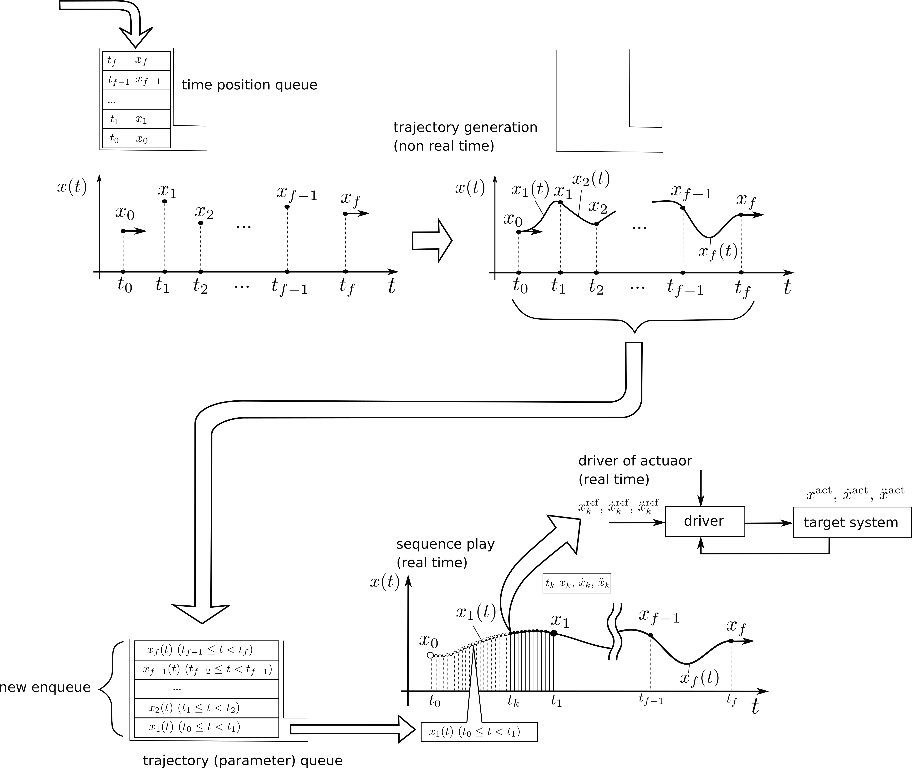
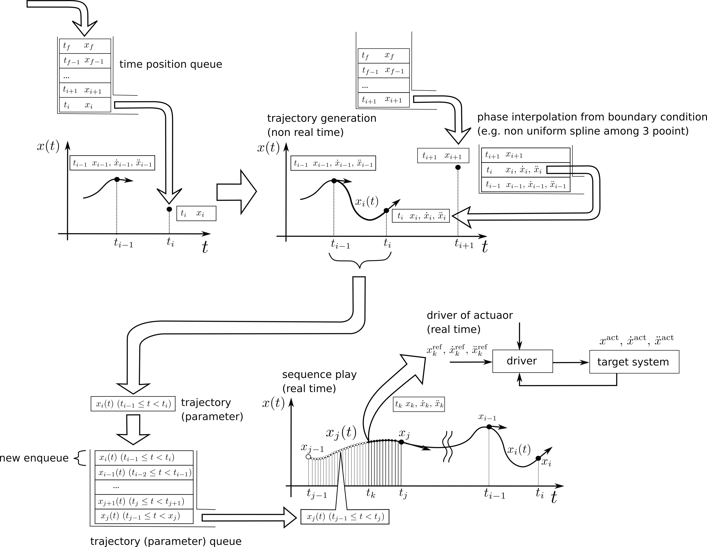

<script type="text/x-mathjax-config">MathJax.Hub.Config({tex2jax:{inlineMath:[['\$','\$'],['\\(','\\)']],processEscapes:true},CommonHTML: {matchFontHeight:false}});</script>
<script type="text/javascript" async src="https://cdnjs.cloudflare.com/ajax/libs/mathjax/2.7.6/MathJax.js?config=TeX-AMS_CHTML"></script>
<script type="text/javascript" async src="https://cdn.jsdelivr.net/npm/mathjax@3/es5/tex-chtml.js" id="MathJax-script"></script>

スプライン補間器
===

# 1. 動作表現モデルとしてのスプライン補間 


点の動作を計算機で表現し、操作したい。  

話を簡単にして、ここでは１次元の点の移動を考える。  
位置の変数を $x$ と表現する。  


静止した点の表現とは異なり、動作する点の表現では位置は時間と共に発展する。  
以下の漫画のように、位置の動作は座標軸１本だけでは１枚の図中に表現しきれない。  


もう１本、時間 $t$ の座標軸を使って表現しよう。  
すると位置 $x$ は時間 $t$ の関数 $x(t)$ として平面上に表現できる。  


位置の時間関数 $x(t)$ は、以下のように時間 $t$ の1次式、2次式、... n次式でモデル化して表現することができるだろう。  
また、sin関数やcos関数、指数関数 $e^{f(t)}$ や対数log関数でモデル表現することもできるだろう。  
動作のモデル表現によって関数の式の取り方は様々である。

$$
\begin{array}{l}  
x(t) = -9.87 (t-1.5)(t-0.6) + 3.2 \\\\  
x(t) = 7.9 \cdot \mathrm{sin} (t - 4 \pi ) \\\\  
x(t) = e^{-3.1 \cdot t^2} + 5t - 4 \\\\  
x(t) = 9t \ \mathrm{log} (t) \\\\  
\cdots \ etc. \\  
\end{array}
$$

上記例ではどれも、一つの決まった式、係数や関数の中身が固定された式で表現されている。  
一つの決まった式よりも、以下のように様々な係数の式を時間と共に区分的に切り替えて変容できた方が多彩な表現を期待できる。 

$$
\begin{array}{rl}  
 x(t | 0.0 \le t < 1.0) =& -0.0205976\ t^3 + 0.0205976\ t^2 - 1.0  \\\\   
 x(t | 1.0 \le t < 2.0) =&  0.150747\ (t-1.0)^3  - 0.0411951\ (t-1.0)^2  - 0.0205976\ (t-1.0) - 1 \\\\  
 x(t | 2.0 \le t < \cdots) =& \cdots  
\end{array}
$$

このように区分多項式を用いて離散的な複数点間同士を任意の補間曲線で結ぶ、スプライン曲線(※)は動作のモデル表現として有用である。  

(※) スプライン曲線は "Isaac Jacob Schoenberg, 'Contributions to the problem of approximation of equidistant data by analytic functions,' 1946" で最初に数学的に定義されたと言われている。本論文では以下のように定義されていた。  
- k個の点を通る曲線は k-1 次以上の多項式で表される
- 少なくとも k-2 次までの導関数を持ち、導関数は全て連続(微分可能)
- 変形多項式曲線をただひとつ取りうる関数とする点は、kが偶数の場合は整数点t=n、奇数の場合はそれ以外の点 t=n+1/2 である。  

&nbsp;

## 1章のまとめ

- 動作表現モデルとして、位置を時間の区分多項式で表す方法を採用する。


&nbsp;

<div style="page-break-before:always"></div>

# 2. 境界条件と曲線の決定

多項式曲線どうしを滑らかに接続したい。  
言い換えると、接続される点で連続かつ微分可能となるように接続したい。  

k 次の多項式どうしが境界で連続かつ微分可能となるように接続されるよう式を決定するには、接続点(境界点)の k-1 次の値を知る必要がある。 
このことを図に表してみよう。  

まず位置-時間平面の曲線 $x(t)$ を考えてみる。   

曲線から曲線へある時刻 $t_i$ でスイッチするとき、その境界点の位置の値 $x_i$ が与えられたとする。  


曲線 $x(t)$ を次の曲線へ境界点で連続かつ微分可能となるように接続したい。  
しかし境界点の位置 $x_i$ の値を知るだけでは、２次以上の k 次多項式の曲線を連続かつ微分可能となるように接続するには情報が不足している。  
時刻 $t_i$ の境界点 $x_i$ で連続かつ微分可能となるには、 その境界点の曲線の傾きを知る必要がある。  


時間関数の境界点の傾きとは、その点での時間による位置の1階微分を意味する。    
位置の時間微分とは速度である。位置の時間関数 $x(t)$ における傾きは、速度 $\dot{x}(t)$ に対応する。 

<div style="page-break-before:always"></div>

物体の運動とは、位置の時間変化と同時に速度、加速度 、、の時間変化が起きる現象である。  
境界点のような瞬時の点においても、位置の値と同時に速度、加速度の値が含まれる。    


位置の点の傾きは、その時刻での位置を時間微分した値、速度値に対応する。  
速度の点の傾きは、その時刻での速度を時間微分した値、加速度値に対応する。  


境界の情報が決まれば、位置の時間曲線は時間多項式モデルの形状にしたがって決まる。  


以上より、  
境界点で連続かつ微分可能となるよう接続できる時間多項式曲線とは、以下の情報が揃っていることで決まるといえる。

- 位置の時間(高次)多項式モデル
- 境界点の時刻、 n 階微分値

どのような多項式モデルを選択するかはユーザの選択に委ねられる。  
一方、境界点の n 階微分値とは、何階までの値が必要か？多項式の次数と同じ数なのか？それより少ないのか？  
ユーザとしては、境界点の入力は 0 階微分値のみ、つまり位置の値のみで済むのが簡単だろう。  
ユーザが境界点の 1 階微分値や 2 階微分値つまり速度値や加速度値まで指定したいケースというのは、よほど専門的なケースに限られるだろう。  


&nbsp;

## 2章のまとめ

- ユーザは曲線形状を決めるスプライン補間器の(多項式)モデルを選択する。
- ユーザは境界条件として境界点の時刻と位置、速度、加速度、、を入力する。  

&nbsp;

<div style="page-break-before:always"></div>


# 3. ユーザ入力パターン

## スプライン補間器のモデル選択

ユーザは曲線形状を決める補間器モデルを選択する。

実装例) 3次元スプライン補間器を選択。　　

```cpp  
#include "cubic_spline_interpolator.hpp"
〜〜
  SplineInterpolator* sp;
  sp = new CubicSplineInterpolator();
```

&nbsp;

続いて、ユーザは曲線が通過する制御点(境界点)、境界条件の入力をする。

境界条件の入力パターンは各補間器モデルで共通化することができる。  
以下、入力パターンを挙げる。

&nbsp;

<div style="page-break-before:always"></div>

## パターン1―開始と終了の２点

ユーザは曲線の両端(境界)の２点を指定する。

- 境界点の時刻
  - 開始時刻 $t_{0}$  
  - 終端時刻 $t_{f}$  
- 境界点の位置  
  - 開始位置 $x_{0}$  
  - 終端位置 $x_{f}$  
- 境界点の速度  
  - 開始速度 $\dot{x}_{0}$  
  - 終端速度 $\dot{x}_{f}$  
- 境界点の加速度  
  - 開始加速度 $\ddot{x}_{0}$  
  - 終端加速度 $\ddot{x}_{f}$  


実装例)   

```cpp  
#include "cubic_spline_interpolator.hpp"
〜〜
  SplineInterpolator* sp;
  sp = new CubicSplineInterpolator();
  double start_time = 0.0;
  double finish_time = 1.5;
  double start_position = 1.0;
  double finish_position = 3.0;
  double start_velocity = -0.1;
  double finish_velocity = 0.0;
  double start_acceleration =  0.4;
  double finish_acceleration = 0.0;
  RetCode ret = sp->generate_path( start_time,         finish_time,
                                   start_position,     finish_position,
                                   start_velocity,     finish_velocity,
                                   start_acceleration, finish_acceleration );
```

以上の入力より、補間器は自動で多項式のパラメータを計算し曲線を内挿して決定する。  
計算方法は各モデルによって異なる。  

&nbsp;

<div style="page-break-before:always"></div>

## パターン2―複数の制御点

ユーザは曲線が通過する開始-終了両端の２点、および通過する中間点群を入力する。  

このとき、開始-終了両端２点は速度、加速度までの境界条件を指定するが、中間点は時刻-位置のみで良い、とする。  

- 各点の時刻・位置の時系列キュー $[(t_{0}, x_{0}), ..., (t_{f}, x_{f}) ]$  
- 開始-終了の両端の速度
  - 開始速度 $\dot{x}_{0}$
  - 終端速度 $\dot{x}_{f}$
- 開始-終了の両端の加速度  
  - 開始加速度 $\ddot{x}_{0}$  
  - 終端加速度 $\ddot{x}_{f}$  


補間器は、中間点の速度、加速度をどうやって自動算出するか？が課題となる。  
何かしらのモデル固有の拘束条件を用いて自動的に算出する必要がある。  


中間点の速度が不明で、かつモデル固有の拘束条件が不明なとき、たとえば時刻-位置の３点が分かれば、丸み不均一スプラインを用いて中間の速度を自動補間する方法もある。  
ただし、自動補間された速度を通る曲線は、制御点付近で位置の行き過ぎ量(オーバーシュート)が大きくなる場合もあり、ユーザにとって好ましくない結果となるかもしれない。  
ユーザが各点の通過速度を１つずつ指定したい場合は、パターン１を利用する。  

実装例)   

```cpp
#include "cubic_spline_interpolator.hpp"
〜〜
  TPQueue tp_queue; // TP = time, position
  tp_queue.push_on_dT( 0.0, -1.0 );
  tp_queue.push_on_dT( 1.0, -1.0 );
  tp_queue.push_on_dT( 2.0, 0.0 );
  tp_queue.push_on_dT( 3.0, 10.1 );

  const double start_velocity = 0.0;
  const double finish_velocity = 0.0;
  const double start_acceleration = 0.0;
  const double finish_acceleration = 0.0;

  SplineInterpolator* sp;
  sp = new CubicSplineInterpolator();
  sp->generate_path( target_tp, 
                     start_velocity,     finish_velocity,
                     start_acceleration, finish_acceleration );
```

&nbsp;

<div style="page-break-before:always"></div>

# 4. 利用シーンの追究

## シーン1―入力した(複数の)補間点間を全て一度に補間し曲線生成



### ユーザのアクション

1. ユーザは複数補間点の時刻・位置の時系列キュー $[(t_{0}, x_{0}), ..., (t_{f}, x_{f}) ]$ を補間器へ入力する。  
2. ユーザは(たとえば動作再生器(sequence player)のような媒体を介して)動作再生を実行する。

### 補間器のアクション

1. 補間器はユーザ入力された補間点キューの中間点群の速度・加速度をすべて自動算出する。  
2. 補間器は境界点の速度・加速度が算出された補間点間の曲線をすべて生成する。  
3. 補間器は生成された曲線(パラメータ)をすべてリアルタイム動作再生のキューにエンキューする。  
4. 再生側では動作再生器(sequence player)のような媒体がおり、この再生器はリアルタイムクロックでカウントされるタイマーを用いて周期的にループし補間器へ出力指令を送り続ける。  
   補間器はリアルタイム時刻 $t_k$ が時間区分に収まる曲線(パラメータ)をデキューし、位置 $x_k$, 速度 $\dot{x}_k$, 加速度 $\ddot{x}_k$ を計算し再生先へ出力する。  

<div style="page-break-before:always"></div>

## シーン2―補間点の追加と曲線生成のタイミングを制御



### ユーザのアクション

1. ユーザは時刻・位置 $(t_f, x_f)$ の補間点を任意のタイミングで補間器へ入力する。  
  (補間点キューが一定以上(たとえば3点以上)貯まると同時に曲線生成が実行される)  
2. ユーザは(たとえば動作再生器(sequence player)のような媒体を介して)動作再生を実行する。
3. 補間器がリアルタイムに曲線動作再生中、ユーザは非同期に補間点をキューへ追加入力する。

### 補間器のアクション

1. 補間器は時刻・位置 $(t_f, x_f)$ の補間点キューが一定以上貯まったら、中間点の速度・加速度を自動算出する。  
2. 補間器は境界点の速度・加速度が算出されたものから順次補間点間の曲線を生成する。
3. 補間器は生成された曲線(パラメータ)をリアルタイム動作再生のキューにエンキューする。  
4. 再生側では動作再生器(sequence player)のような媒体がおり、この再生器はリアルタイムクロックでカウントされるタイマーを用いて周期的にループし補間器へ出力指令を送り続ける。  
   補間器はリアルタイム時刻 $t_k$ が時間区分に収まる曲線(パラメータ)をデキューし、位置 $x_k$, 速度 $\dot{x}_k$, 加速度 $\ddot{x}_k$ を計算し再生先へ出力する。  

<div style="page-break-before:always"></div>

## シーン3―割り込み入力による曲線のリアルタイム更新


### ユーザのアクション

1. (Step1)まではシーン１と同様。ユーザは、時刻・位置のキューを入力し、動作再生を実行。
2. 動作再生実行中、ユーザは入力済みの時刻・位置のキューをクリアし、新しいキューを割り込んで入力する(Step2)。  
   動作は位置・速度ともに連続して滑らかに遷移しながら再生を続けられる(〜Step3)。  

### 補間器のアクション

1. (Step1)まではシーン１と同様。補間器は曲線動作再生を実行中。
2. (Step2)で補間器はユーザから割り込み動作入力を受け取る。  
3. 補間器は再生中の曲線動作の現在時刻 $t_k$ の点から補間計算時間を加味した遷移開始時刻 $t'_0$ を特定する。  
4. 補間器はリアルタイム動作再生のキューを再生中の曲線のみ残し、再生中の曲線の終端時刻を $t'_0$ に置換する。  
5. 補間器は遷移前の軌道から遷移開始時刻 $t_0$ における位置 $x'_0$ ・速度 $\dot{x'}_0$ ...を抽出する。  
6. 補間器は遷移開始時刻・位置・速度および新しい時刻・位置のキューから、中間点群の速度・加速度をすべて自動補間する。  
   以降、補間器はシーン１の補間器のアクションと同様に処理実行する(〜Step3)。  

<div align="right"> 以上. </div>
